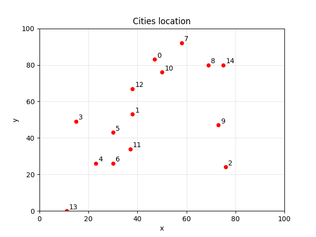
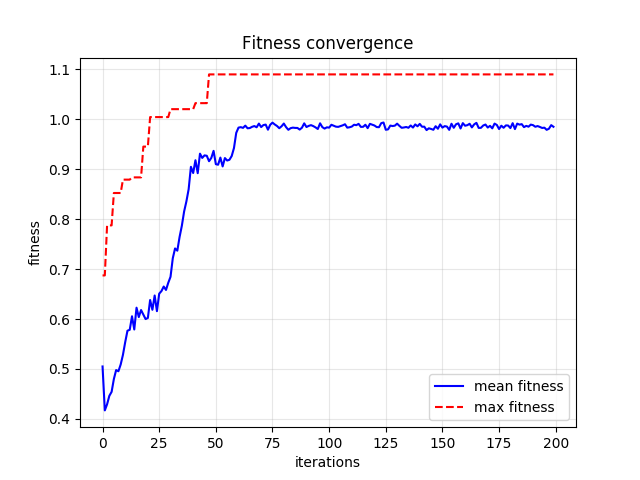
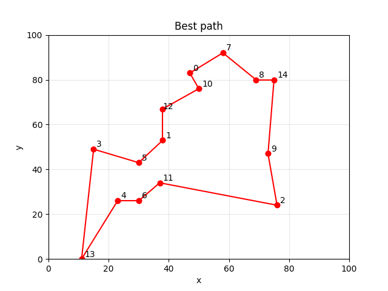

# Genetic TSP

Genetic algorithm to solve the travelling salesman problem (TSP):

> _"Given a list of cities and the distances between each pair of cities, what is the shortest possible route that visits each city and returns to the origin city?"_ — From [Wikipedia](https://en.wikipedia.org/wiki/Travelling_salesman_problem)


## Images

<p align="center">
    
    
    
</p>


## Installation

To install the dependencies, run the following command:

```bash
pip install -r requirements.txt
```


## Usage

Run the menu with the following command:

```python
python run.py
```